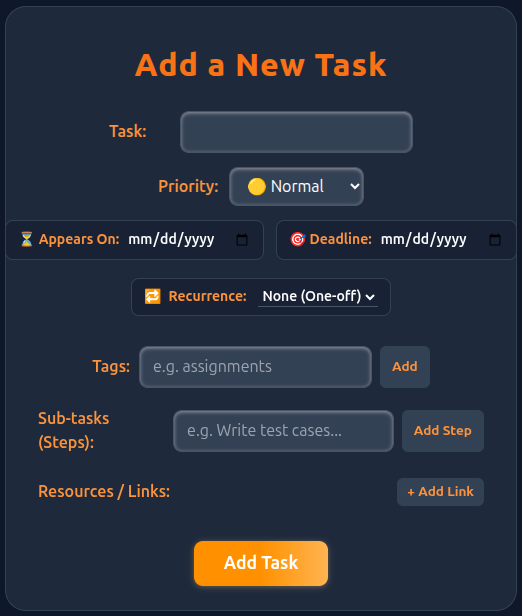
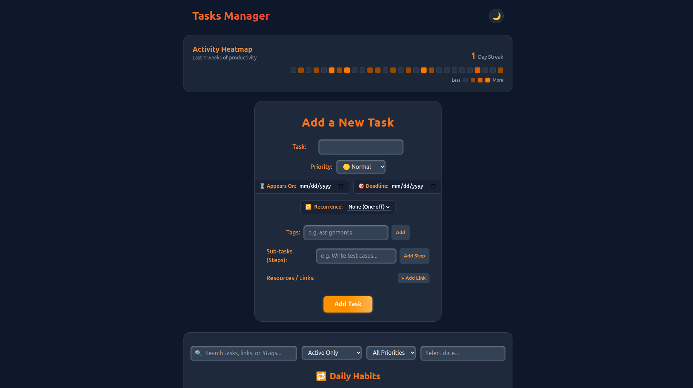
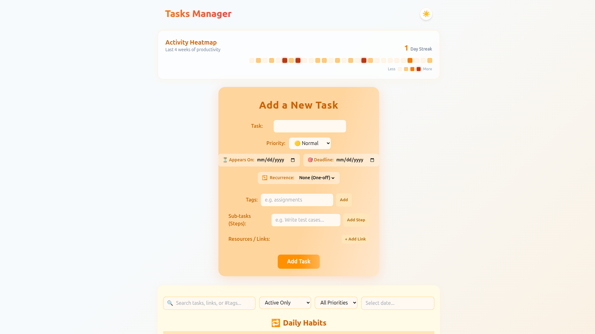
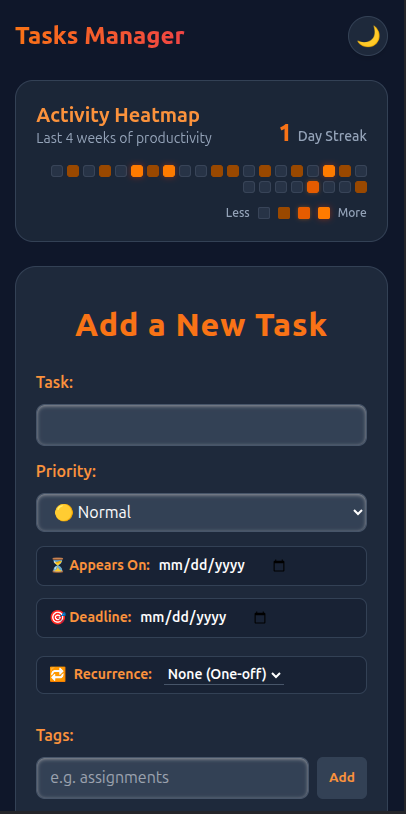
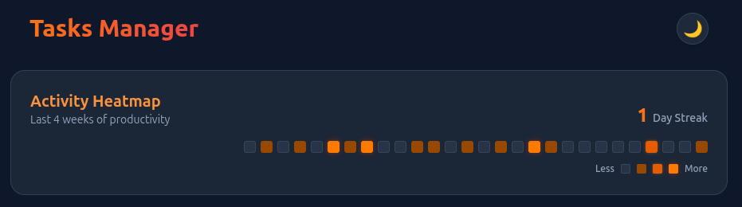
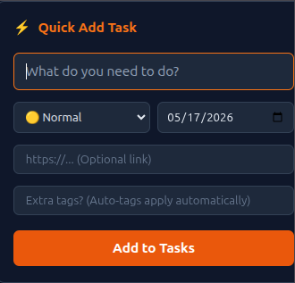

# TaskVault

A modern full-stack productivity and task management platform built with React, Supabase, and real-time synchronization.

TaskVault is designed for high-performance personal productivity with features like recurring habits, smart task organization, realtime sync, biometric vault locking, analytics, consistency tracking, and responsive cross-device experience.

---

## 🚀 Live Demo

```bash
https://tasks-manager-coral.vercel.app/
```

---

## ✨ Features

### Core Productivity

* Create, edit, delete, and organize tasks
* Priority management (Urgent / Normal / Later)
* Deadlines and completion tracking
* Inline task editing
* Smart filtering and searching
* Quick Add modal (keyboard shortcut powered)

### Advanced Task Management

* Recurring daily habits
* Subtasks support
* Smart auto-generated tags
* Task links and resources
* Completion history tracking
* Archive-ready architecture

### Realtime & Sync

* Realtime synchronization using Supabase Realtime
* Optimistic UI updates
* Instant cross-session updates
* Protected vault-style unlocking

### Security

* Local vault PIN protection
* Biometric authentication support
* Session-based protection routes

### UI / UX

* Fully responsive UI
* Dark mode support
* Modern glassmorphism-inspired interface
* Mobile optimized interactions
* Keyboard shortcuts
* Toast notifications

### Analytics & Consistency

* Productivity heatmap
* Habit consistency visualization
* Analytics-ready routing architecture

### Developer Experience

* Modular architecture
* Custom React hooks
* Context API integration
* Reusable UI components
* Lazy-loaded routes
* Automated testing setup

---

# 🧪 Testing

This project includes automated testing using:

* Vitest
* React Testing Library

### Current Test Coverage

* Component testing
* Hook testing
* Route protection testing
* Utility testing

Run tests:

```bash
npm run test
```

---

# 🛠️ Tech Stack

## Frontend

* React
* React Router
* Tailwind CSS
* React Hot Toast

## Backend / Database

* Supabase
* PostgreSQL
* Supabase Realtime

## Testing

* Vitest
* React Testing Library

## Deployment

* Vercel

---

# 📁 Project Structure

```bash
src/
│
├── components/
├── pages/
├── hooks/
├── context/
├── layouts/
├── routes/
├── services/
├── tests/
├── utils/
└── ui/
```

---

# ⚙️ Installation & Setup

## 1. Clone Repository

```bash
git clone https://github.com/AtulBoyal/Tasks_Manager
cd Tasks_Manager/frontend
```

## 2. Install Dependencies

```bash
npm install
```

## 3. Configure Environment Variables

Create a `.env` file:

```env
REACT_APP_SUPABASE_URL=your_supabase_url
REACT_APP_SUPABASE_ANON_KEY=your_supabase_anon_key
```

---

# ▶️ Run Locally

```bash
npm start
```

---

# 🏗️ Build Production Version

```bash
npm run build
```

---

# 🧪 Run Tests

```bash
npm run test
```

---

# 📸 Screenshots

* Dashboard
* Dark Mode
* Light Mode
* Mobile UI
* Heatmap
* Quick Add Modal

Example:

```md






```

---

# 🧠 Engineering Highlights

* Optimistic state management
* Realtime subscriptions
* Modular scalable architecture
* Context-driven shared state
* Custom hooks abstraction
* Protected route architecture
* Production-ready component separation
* Mobile-first responsive design

---

# 🔒 Security Notes

Environment variables are excluded using `.gitignore`.

No sensitive credentials are committed to the repository.

---

# 📌 Future Improvements

* AI-powered task suggestions
* Calendar integration
* Team collaboration
* Drag-and-drop kanban
* Offline support
* PWA support
* Notifications & reminders
* Advanced analytics dashboard

---

# 👨‍💻 Author

Atul Boyal

* IIT Hyderabad
* Full Stack Developer
* Systems & Product Engineering Enthusiast

---

# 📄 License

This project is licensed under the MIT License.
